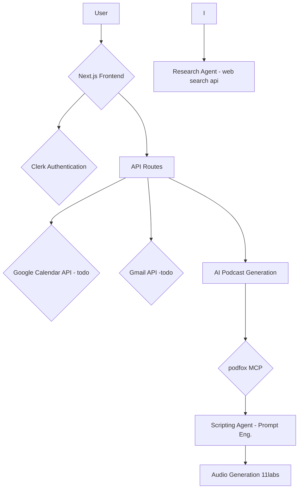

# Podfox - Your Personalized AI Podcast Generator

**Submission for the MCP and Agents Hackathon w/ Featureform, Ridge Ventures, Smithery, and Martian.**

[](https://smithery.ai/server/@sauravtom/podfox-audio-tours)

Podfox is a cutting-edge application that transforms your interests into personalized, engaging podcasts. By leveraging the power of AI, Podfox curates content based on your favorite topics, delivering a unique listening experience every time.

## Features

- **Personalized Content:** Generates podcasts based on user-defined interests.
- **AI-Powered:** Utilizes advanced AI to research, script, and produce high-quality audio content.
- **Seamless Integration:** Connects with your Google Calendar and Gmail to create relevant content based on your schedule and communications.
- **User-Friendly Onboarding:** A simple, step-by-step process to get you started in minutes.
- **Secure Authentication:** Employs Clerk for robust and secure user management.

## Architecture Diagram



## Getting Started

### Prerequisites

- Node.js (v20 or later)
- npm

### Installation

1. **Clone the repository:**
   ```bash
   git clone https://github.com/your-username/podfox.git
   cd podfox
   ```

2. **Install dependencies:**
   ```bash
   npm install
   ```

3. **Set up environment variables:**
   Create a `.env.local` file in the root of the project and add the following environment variables:

```
NEXT_PUBLIC_CLERK_PUBLISHABLE_KEY=your_clerk_publishable_key
CLERK_SECRET_KEY=your_clerk_secret_key
NEXT_PUBLIC_CLERK_SIGN_IN_URL=/sign-in
NEXT_PUBLIC_CLERK_SIGN_UP_URL=/sign-up
NEXT_PUBLIC_CLERK_SIGN_IN_FALLBACK_REDIRECT_URL=/onboarding
NEXT_PUBLIC_CLERK_SIGN_UP_FALLBACK_REDIRECT_URL=/onboarding
```


4. **Run the development server:**
   ```bash
   npm run dev
   ```

Open [http://localhost:3000](http://localhost:3000) in your browser to see the application.

## Tech Stack

- **Frontend:** Next.js, React, Tailwind CSS, Shadcn UI
- **Authentication:** Clerk
- **AI:** OpenAI, Exa
- **Google APIs:** Gmail, Google Calendar
- **Deployment:** Vercel

## Project Structure

```
/src
├── app/                # Main application routes
│   ├── api/            # API endpoints
│   ├── dashboard/      # User dashboard
│   └── ...
├── components/         # Reusable UI components
├── lib/                # Helper functions and utilities
└── ...
```

---

*This project was created for the MCP and Agents Hackathon and is a demonstration of the power of AI-driven content creation.*
